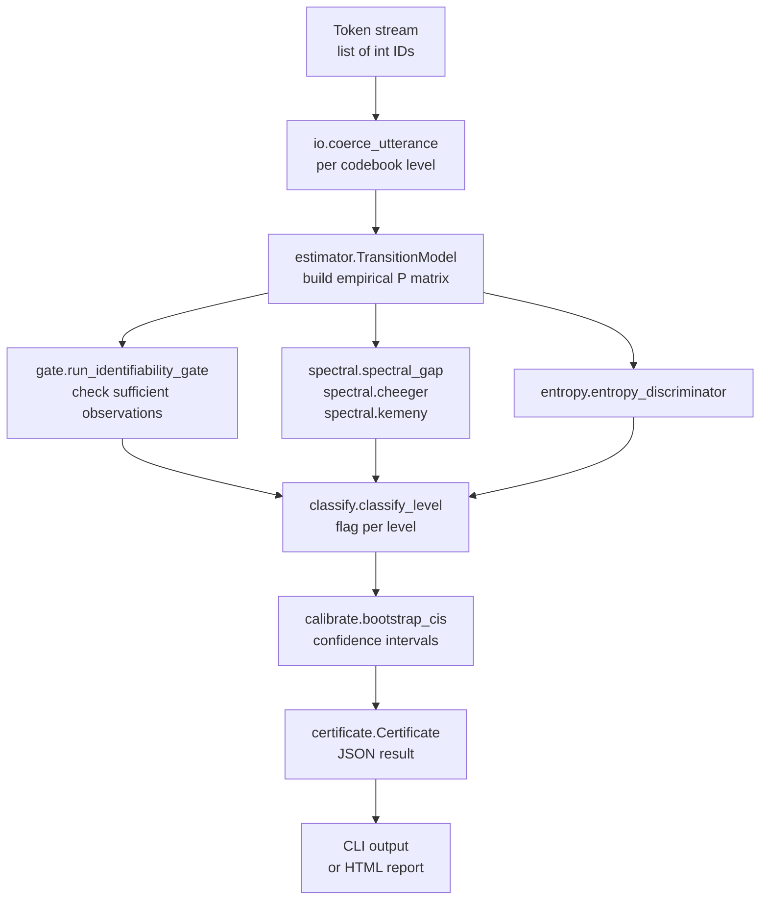

# ergogauge

[](https://github.com/hinanohart/ergogauge/actions/workflows/ci.yml)
[](LICENSE)


**A CPU-only, reference-free, decode-free ergodicity certificate for generated codec-LM token streams.**

ergogauge takes the integer token IDs emitted by an autoregressive audio/speech/codec language model (e.g. CosyVoice, Spark-TTS, VALL-E-family, MusicGen, AudioGen, Qwen2.5-Omni Talker) and treats them as a finite-state Markov chain. From the empirical token-transition operator it computes an *ergodicity certificate* — spectral gap, Kemeny constant, and Cheeger/Fiedler near-reducibility — then classifies the stream as `HEALTHY`, `REPETITIVE`, `LOCKED`, `COLLAPSED`, or `OVER_RANDOM`. No reference audio, no vocoder, no LLM judge, and no GPU required.

> **What it is / is not.** ergogauge is a CPU-only, reference-free, decode-free, LLM-free diagnostic instrument that treats a generated codec-LM token stream as a finite-state Markov chain and reports an ergodicity certificate (spectral gap, Kemeny constant, Cheeger/Fiedler near-reducibility) from the empirical token-transition operator. It is NOT a replacement for FAD/MMD/UTMOS (it is a complementary, reference-free, decode-free axis), NOT an audio-quality benchmark, and makes NO claim about perceptual quality or that it fixes/solves generation quality. The invariant->failure-mode mapping on non-reversible chains is a CALIBRATED HEURISTIC, not a theorem; flags are reported with bootstrap confidence intervals and fail-closed ABSTAIN below the pre-registered identifiability threshold. Primary correctness is demonstrated on a synthetic injected-pathology harness; any real codec-LM token demo is secondary and labelled synthetic-vs-real.

---

## Architecture



---

## Install

```bash
pip install -e .            # core: numpy only
pip install -e ".[viz]"     # + matplotlib for self-contained HTML reports
pip install -e ".[dev]"     # + pytest / ruff / mypy
pip install -e ".[demo]"    # + torch/encodec for the optional real-token example
```

The core library and CI are **torch-free**; torch is confined to the optional `[demo]` extra (`examples/real_demo.py`).

---

## Quickstart

### Python API

```python
from ergogauge import certify, certify_corpus

# Single utterance (advisory / low-confidence by default)
cert = certify([3, 7, 3, 7, 3, 7, 3, 7])      # a loop
print(cert.aggregate["flags"])                 # -> ['REPETITIVE']

# Corpus (the confident path): list of per-utterance token lists
cert = certify_corpus([u1, u2, u3, ...])
print(cert.to_json())
```

`certify` accepts a `list[int]` (single codebook), `list[list[int]]` (multi-codebook RVQ), a `{"tokens": ...}` / `{"codebooks": ...}` dict, or a path to a `.json` / `.npz` file.

### CLI

```bash
ergogauge certify tokens.json        # full certificate (JSON)
ergogauge gap tokens.json            # spectral gap only
ergogauge cheeger tokens.json        # Cheeger / Fiedler
ergogauge vendi-compare tokens.json  # order-sensitivity sanity check vs in-repo Vendi
ergogauge doctor tokens.json         # identifiability / ABSTAIN diagnosis
ergogauge report tokens.json -o report.html   # self-contained HTML ([viz])
```

---

## How it works

A degenerate autoregressive generator leaves a structural fingerprint in its own token sequence. ergogauge reads that fingerprint via three complementary axes:

| Axis | Quantity | Detected failure | Basis |
|---|---|---|---|
| Spectral gap `g = 1 - \|λ₂(P)\|` | Mixing speed of the directed empirical chain | `REPETITIVE` / loop | Calibrated heuristic |
| Cheeger / Fiedler `φ`, `λ₂(L_sym)` | Near-reducibility of the symmetrized graph | `LOCKED` (sub-vocabulary / timbre lock) | Two-sided bound is a theorem; flag is heuristic |
| Kemeny constant `K` | Exploration scalar | — | Convenience scalar (overlaps gap; not localized) |
| Occupancy / transition-entropy ratio | Structure vs uniform null | `OVER_RANDOM` vs `HEALTHY` | Discriminator A4 |

The **identifiability gate** checks that enough token pairs have been observed to make a confident call. If the gate fails, the result is `ABSTAIN` rather than a potentially wrong flag.

---

## Correctness (synthetic, primary)

All numbers below are generated by `scripts/gen_metrics.py` into [`results/0.1.0a2_metrics.json`](results/0.1.0a2_metrics.json) on the **full 100-seed held-out TEST set** (seeds 1000–1099); thresholds were calibrated on the disjoint TRAIN seeds (0–99). Regime: easy-extreme (V=64, L=2000, 16 utterances/corpus, stationary block-bootstrap). The shipped numbers are generated with `bootstrap_reps=30` (the CI-gated label clears its threshold by a wide margin in this regime, so it is robust to reps; fewer reps only widen CIs, the fail-closed direction — `CLAIM.md` §4 default is 1000).

| Ground truth | Detected | Recall (100 TEST seeds) |
|---|---|---|
| HEALTHY | HEALTHY | 1.00 |
| REPETITIVE | REPETITIVE | 1.00 |
| LOCKED | LOCKED | 1.00 |
| OVER_RANDOM | OVER_RANDOM | 1.00 |
| COLLAPSED | COLLAPSED | 1.00 |

- Macro recall **1.00**; HEALTHY false-flag rate **0.00** (100/100 per class).
- Severity is tracked monotonically: Spearman of `(ρ, −spectral_gap)` for REPETITIVE = **1.00** and of `(−log₁₀ δ, −cheeger_phi)` for LOCKED = **1.00**.
- Hard-extreme / degenerate inputs (short, underdetermined, empty) ABSTAIN at rate **1.00** with **0.00** confident-pathology rate (fail-closed; see `tests/test_fail_closed.py`).
- G9 separation: HEALTHY entropy-ratio CI mean ≈ [0.70, 0.78] vs OVER_RANDOM ≈ [0.96, 0.98] (CI gap **0.18**, excludes 0).
- Order-sensitivity sanity check: the ergogauge spectral gap separates a loop from its shuffle (AUROC **1.00**) where the order-independent in-repo Vendi cannot (AUROC **0.50**). Structural check, **not** a superiority claim (`vendi_wedge=false`).

**Honest scope — thresholds are calibrated for V=64.** A grid-robustness sweep shows the pre-registered thresholds do **not** yet transfer across alphabet sizes: at V=16 the HEALTHY generator is mis-flagged (recall 0.0) and at V=256 OVER_RANDOM / REPETITIVE are mis-flagged. Per-alphabet calibration is **ROADMAP**; v0.1.0a2 claims the easy-extreme V=64 regime only. The easy-extreme numbers are saturated by construction; harder regimes (weak loops, sub-resolution locks, single short utterances) fail **closed to ABSTAIN** rather than guessing. Reproduce: `python scripts/gen_metrics.py`.

---

## Why this / relation to other tools

You have token IDs but no reference set, no LLM judge, and no time to vocode and run a perceptual metric. A degenerate generator's loops collapse the spectral gap; sub-vocabulary lock collapses the Cheeger conductance. ergogauge reads that fingerprint directly from the token stream.

- **Vendi Score** (arXiv:2210.02410) measures order-independent set diversity; ergogauge measures a temporal/transition axis. Complementary. The in-repo Vendi re-implementation is used as an order-sensitivity sanity check, not a baseline to beat.
- **koopgauge** (`hinanohart/koopgauge`) performs a Koopman/DMD spectral audit on *continuous latent states*. ergogauge operates on a *stochastic transition operator over discrete integer token IDs* — disjoint object, no shared modules.

ergogauge claims no invention of the Markov framework, the Kemeny constant, the Cheeger inequality, or the spectral gap. Prior theory: arXiv:2410.02724 (LLMs as Markov Chains), 2012.14660 / 2402.13512 (repetition / distribution-collapse mechanisms), 2210.02410 (Vendi Score), 2409.19283 (discrete representation inconsistency). To our knowledge none ships a reference-free CPU-only ergodicity certificate for generated codec-LM token streams.

---

## License

MIT — see [LICENSE](LICENSE) and [NOTICE](NOTICE). See [docs/CLAIM.md](docs/CLAIM.md) for pre-registered thresholds and [docs/NON-CLAIM.md](docs/NON-CLAIM.md) for scope.
